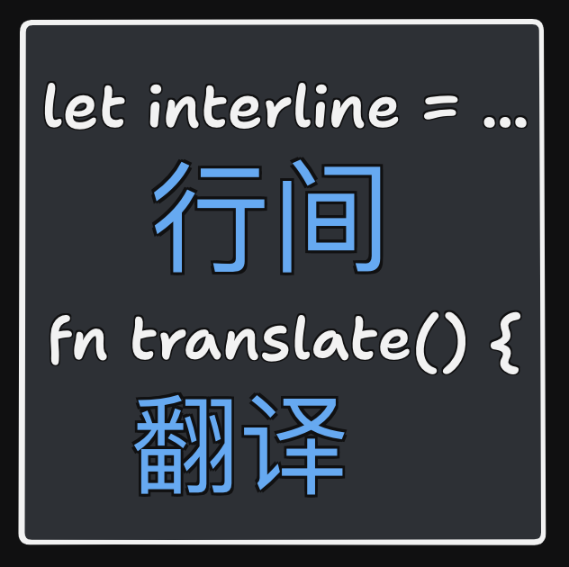
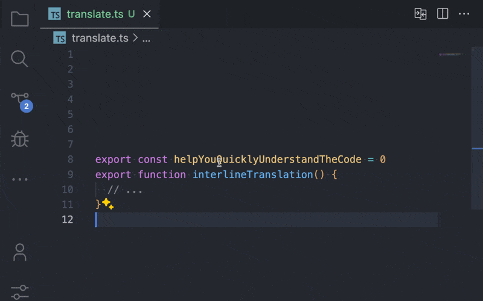
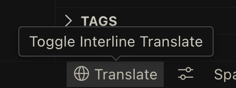

  

简体中文｜[English](https://github.com/LittleSound/interline-translate#readme)

# Interline Translate

Interline Translate 是一个 VSCode 扩展，它的功能是在 VSCode 中提供代码变量名翻译。翻译的文本会显示在变量名的下方，这也是它名字 Interline Translate 的由来。

## 功能

<!-- Tip: 利用动画来展示你的扩展是一个很好的方式。我们建议使用简短、集中的动画，使用户更容易跟随。 -->

- 自动翻译代码中的变量名，并在其下方显示翻译文本。
- 支持多种编程语言和翻译语言。
- 轻松配置和自定义翻译选项。

  

  

- 您可以使用状态栏上的按钮来控制翻译功能。
- 点击旁边的次要按钮进行详细设置。
- 或者您可以使用快捷键 `Ctrl+Shift+P` 打开命令面板并输入 `Interline Translate` 来使用扩展功能。

## 要求

此扩展需要以下依赖项：

- 必须安装并配置相应的翻译 API（例如 Google Translate API）。
- 需要互联网连接以访问翻译服务。

## 扩展设置

此扩展提供了以下设置：

* `interline-translate.translateSelectedText`: 打开翻译控制面板。
* `interline-translate.startTranslatingDocuments`: 快速开始翻译。

<!-- ## Known Issues -->
<!-- 请在此处列出已知问题，以帮助用户避免重复提交相同的问题。 -->

## 支持我

如果你喜欢这个项目，可以通过以下方式支持我：

- [☕️ 捐赠 Sponsor](https://github.com/sponsors/LittleSound)
- [⭐️ 给这个项目点个 Star](https://github.com/LittleSound/interline-translate)
- 分享给你的朋友

## 其它翻译插件推荐

- 翻译注释或者字符串：[Comment Translate](https://marketplace.visualstudio.com/items?itemName=intellsmi.comment-translate)
- 在网页中翻译文本：[沉浸式翻译](https://immersivetranslate.com/)
