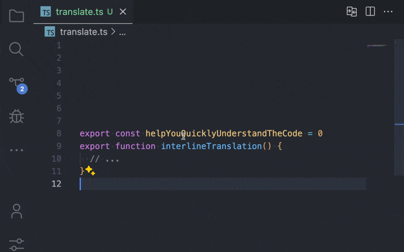

  

[简体中文](https://github.com/LittleSound/interline-translate/blob/main/README-cn.md)｜English

# Interline Translate

Interline Translate is a VSCode extension that provides code variable name translation within VSCode. The translated text is displayed below the variable name, which is the origin of its name, Interline Translate.

## Features

<!-- Tip: Using animations to showcase your extension is a great way to engage users. We recommend short, focused animations to make it easier for users to follow. -->

- Automatically translates variable names in the code and displays the translated text below them.
- Supports multiple programming languages and translation languages.
- Easy to configure and customize translation options.

  

  

- You can use the buttons on the status bar to control the translation function.
- Click the secondary button next to it for detailed settings.
- Or you can open the command palette with the shortcut `Ctrl+Shift+P` and enter `Interline Translate` to use the extension's features.

## Requirements

This extension requires the following dependencies:

- A corresponding translation API (e.g., Google Translate API) must be installed and configured.
- An internet connection is required to access the translation services.

## Extension Settings

This extension provides the following settings:

* `interline-translate.translateSelectedText`: Open the translation control panel.
* `interline-translate.startTranslatingDocuments`: Quickly start translating.

<!-- ## Known Issues -->
<!-- List known issues here to help users avoid submitting duplicate issues. -->

## Support Me

If you like this project, you can support me in the following ways:

- [☕️ Sponsor](https://github.com/sponsors/LittleSound)
- [⭐️ Give this project a Star](https://github.com/LittleSound/interline-translate)
- Share with your friends

## Other Translation Plugin

- [Comment Translate](https://marketplace.visualstudio.com/items?itemName=intellsmi.comment-translate) - Translate comments or strings
- [Immersive Translate](https://immersivetranslate.com/) - Translate text on web pages

## Release Notes

### 0.2.0

* fix: remove empty codelens ([#5](https://github.com/LittleSound/interline-translate/pull/5))
* feat: persist translate cache ([#6](https://github.com/LittleSound/interline-translate/pull/6))
* feat: one click status bar toggle ([#7](https://github.com/LittleSound/interline-translate/pull/7))
* feat: normalize `knownWords` to lower case ([#8](https://github.com/LittleSound/interline-translate/pull/8))
* feat: custom translations ([#9](https://github.com/LittleSound/interline-translate/pull/9))
* feat: hover to mark as known ([#10](https://github.com/LittleSound/interline-translate/pull/10))

### 0.1.0

* feat: add configs to skip translations for some words ([#4](https://github.com/LittleSound/interline-translate/pull/4))
* feat: format multi-word variables

### 0.0.1

* initial release. Implemented basic code variable name translation functionality.
